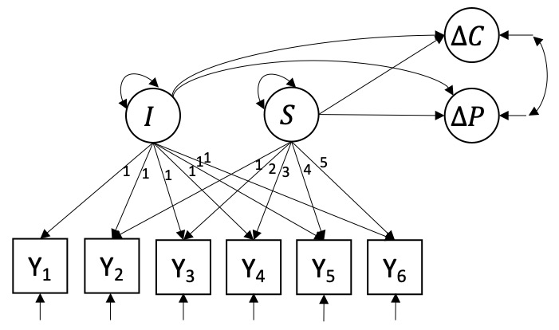
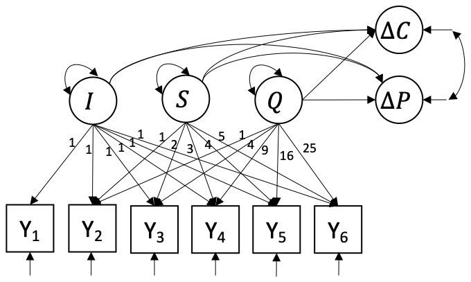
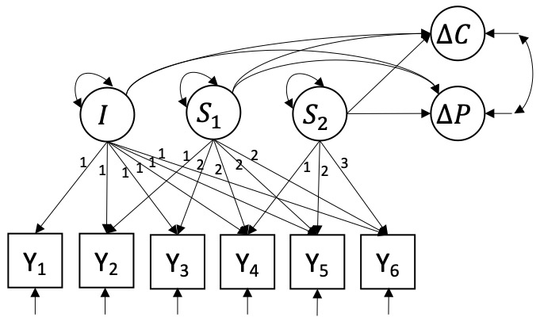

```{r setup, echo = F}
library(panelr)
library(plyr)
library(ggplot2)
library(dplyr)
library(plotly)
library(knitr)
library(lavaan)
library(kableExtra)
library(jtools)
```

```{r data, echo = F, eval = T, results=F} 
dat <- read.table(file = "/Users/jeroenmulder/SURFdrive/Research/Applied - LGCM PTSS/data/20201218_Psychology_PTSS_data.dat"
                  , header = T
                  , col.names = c("Dissociatief", "OCD", "Angst", "Anorexia", "Boulimia", "Eet", "Stemming", "Cluster_A", "Cluster_B", "Cluster_C", "Ongespecificeerd_Prs", "Ander_Prs", "Border", "Autisme", "ADHD", "Dissociatief_Id", "Ongespecificieerd_diss", "Ander_diss", "Somatisch", "Conversie", 
                                  "PCL.1", "PCL.2", "PCL.3", "PCL.4", "PCL.5", "PCL.6", 
                                  "TVAS.1", "TVAS.2", "TVAS.3", "TVAS.4", "TVAS.5", "TVAS.6", 
                                  "CAPS_scr", "CAPS_scr_diag", "CAPS_FU4", "CAPS_FU4_diag", "BE_CAPS",  
                                  "PCL_scr", "PCL_voor", "PCL_FU4", "BE_PCL", "BE_PCL_FU4_scre"))

dat[dat == 999] <- NA # Recode missing values (999) as NA
summary(dat) # Screen for inadmissible values
dat %>% # Compute SDs for CAPS-5 and PCL-5 before and after treatment
  select(CAPS_scr, CAPS_FU4, PCL_voor, PCL_FU4) %>%
  apply(2, sd, na.rm = T)

# Reshape into long format
dat.long <- long_panel(dat, prefix = ".", begin = 1, end = 6, label_location = "end") %>% ungroup()
```

## Introduction
In these supplementary materials we provide a detailed rationale for presenting the linear latent growth curve model (L-LGCM) and the piecewise linear latent growth curve model (with turning point at the third measurement occasion, P3-LGCM) in the main manuscript. The goal of the study is to investigate if we can predict a decrease in PTSD symptomatology 4 weeks after completion of an intensive outpatient treatment program (compared to their pre-treatment measurement), from how patients progress through the treatment program itself. PTSD symptomatology was measured using the CAPS-5 and the PCL-5 such that $\Delta C$ represents a decrease on the CAPS-5 scale, and $\Delta{P}$ a decrease on the PCL-5 scale.[^1] We compare five versions of the LGCM, each with different growth factors, to determine which particular model can make the most accurate predictions for $\Delta{C}$ and $\Delta{P}$ for new patients. To this end, $k$-fold cross-validation was used to compare the out-of-sample prediction performance of five candidate LGCMs.

The five models are introduced below. Afterwards, we set up the cross-validation study and present the results. We end by fitting the optimal model to the entire dataset, the results of which are presented in the main manuscript. All analyses were performed using the *lavaan* package version 0.6-7 [@Rosseel2012] in R version 3.6.1 [@RCoreTeam2019]. Full information maximum likelihood was used to deal with missing data. *lavaan* code for each model and R code for the cross-validation can be found here and on [Github](https://github.com/JeroenDMulder/predicting-PTSD-using-LGCM).

[^1]: Further details concerning the data are provided in the main manuscript.

## Candidate models
We first visualize the data to gain some insight in how patients progress through the treatment program. $n = 109$ patients have been measured repeatedly at $T = 6$ occasions during treatment. Figure \@ref(fig:plot-growth) shows the patients change in their daily PTSD symptomatology as measured using the abbreviated PCL-5 (individual trajectories can be spotlighted by double clicking on a patient number in the legend). There appear to be large differences in PTSD severity at the start of the treatment, as well as differences in patient development through the treatment.

```{r growth, echo = F, eval = T}
# Compute means per time point
dat.waveMeans <- dat.long %>% 
  group_by(wave) %>%
  dplyr::summarise(PCL = mean(PCL, na.rm = T))

# PCL - Visualize individual trajectories
plot.GC.PCL <- dat.long %>%
  # filter(id %in% c(26, 73, 96, 45, 108, 100, 59, 49, 37, 31)) %>% # Select individuals for ease of presentation
  ggplot(aes(x = wave, y = PCL)) + 
    geom_point(aes(color = id, alpha = 0.4)) + 
    geom_line(aes(color = id, alpha = 0.4)) + 
    geom_point(data = dat.waveMeans, aes(x = wave, y = PCL)) + 
    geom_line(data = dat.waveMeans, aes(x = wave, y = PCL)) + 
    labs(color = "Patient", x = "Day", y = "PTSD (8-item PCL-5)") +
    theme(legend.title = element_blank())
```

```{r plot-growth, echo = F, fig.cap = "Change in PTSD symptomatology (PCL-5) of the entire sample. The bold black line represents the mean change. Individual trajectories can be inspecting by double-clicking on a patient's number in the legend on the right of the plot.", eval = T}
ggplotly(plot.GC.PCL)
```

The five candidate LGCMs are conceptualized as structural equation models (SEM) and differ in how patient progress is modeled, either as a linear, quadratic, or piecewise change over time. As such, the models have different latent factors (i.e., growth components) to describe patient progress, and subsequently predict $\Delta{C}$ and $\Delta{P}$. The Q-LGCM and P-LGCM were selected as candidates because they allow for non-linear trajectories, which is something that is generally expected within psychological health research and for the treatment patients are receiving [@Jones2000], and because there is a clinical interest in the predictive power of early treatment progress, which can only be modeled with piecewise trajectories. The candidate models are introduced in detail in the tabs below.  

```{r models, echo = F, eval = T, results=F}
# Create list to save models and model trajectories in. 
model <- trajectory <- vector("list", length = 5)

# Linear LGCM using VAS scale
LGCM.VAS <- " 
  # Model developmental process
  I =~ 1*TVAS.1 + 1*TVAS.2 + 1*TVAS.3 + 1*TVAS.4 + 1*TVAS.5 + 1*TVAS.6
  S =~ 0*TVAS.1 + 1*TVAS.2 + 2*TVAS.3 + 3*TVAS.4 + 4*TVAS.5 + 5*TVAS.6
  I ~~ 0*S # Constrain covariance between growth components to 0
  
  # Predict change in PTSD (BE_) from growth factors
  BE_CAPS + BE_PCL~ 1 + I + S
  BE_CAPS ~~ BE_CAPS 
  BE_PCL ~~ BE_PCL
"
fit.LGCM.VAS <- growth(model = LGCM.VAS, data = dat, missing = "ML")
fitmeasures(fit.LGCM.VAS)

# Linear LGCM 
trajectory[[1]] <- " 
  # Model linear developmental process
  I =~ 1*PCL.1 + 1*PCL.2 + 1*PCL.3 + 1*PCL.4 + 1*PCL.5 + 1*PCL.6
  S =~ 0*PCL.1 + 1*PCL.2 + 2*PCL.3 + 3*PCL.4 + 4*PCL.5 + 5*PCL.6
  I ~~ 0*S # Constrain covariance between growth components to 0
"

# Quadratic LGCM with dummies for comorbidities as predictors of latent growth factors
trajectory[[2]] <- '
  # Model quadratic developmental process
  I =~ 1*PCL.1 + 1*PCL.2 + 1*PCL.3 + 1*PCL.4 + 1*PCL.5 + 1*PCL.6
  S =~ 0*PCL.1 + 1*PCL.2 + 2*PCL.3 + 3*PCL.4 + 4*PCL.5 + 5*PCL.6
  Q =~ 0*PCL.1 + 1*PCL.2 + 4*PCL.3 + 9*PCL.4 + 16*PCL.5 + 25*PCL.6
  I ~~ 0*S + 0*Q # Constrain covariance between growth components to 0
  S ~~ 0*Q
'

# Piecewise LGCM with turning point at 2nd measurement
trajectory[[3]] <- '
  # Model piecewise-linear developmental process
  I =~ 1*PCL.1 + 1*PCL.2 + 1*PCL.3 + 1*PCL.4 + 1*PCL.5 + 1*PCL.6
  S1 =~ 0*PCL.1 + 1*PCL.2 + 1*PCL.3 + 1*PCL.4 + 1*PCL.5 + 1*PCL.6
  S2 =~ 0*PCL.1 + 0*PCL.2 + 1*PCL.3 + 2*PCL.4 + 3*PCL.5 + 4*PCL.6
  I ~~ 0*S1 + 0*S2 # Constrain covariance between growth components to 0
  S1 ~~ 0*S2
'

# Piecewise LGCM with turning point at 3rd measurement
trajectory[[4]] <- '
  # Model piecewise-linear developmental process
  I =~ 1*PCL.1 + 1*PCL.2 + 1*PCL.3 + 1*PCL.4 + 1*PCL.5 + 1*PCL.6
  S1 =~ 0*PCL.1 + 1*PCL.2 + 2*PCL.3 + 2*PCL.4 + 2*PCL.5 + 2*PCL.6
  S2 =~ 0*PCL.1 + 0*PCL.2 + 0*PCL.3 + 1*PCL.4 + 2*PCL.5 + 3*PCL.6
  I ~~ 0*S1 + 0*S2 # Constrain covariance between growth components to 0
  S1 ~~ 0*S2
'

# Piecewise LGCM with turning point at 3rd measurement (equivalent to L-LGCM with T = 3). 
trajectory[[5]] <- '
  # Model linear developmental process for only first week
  I =~ 1*PCL.1 + 1*PCL.2 + 1*PCL.3 
  S1 =~ 0*PCL.1 + 1*PCL.2 + 1*PCL.3 
  I ~~ 0*S1  # Constrain covariance between growth components to 0
'
```

```{r panelset, echo=FALSE}
xaringanExtra::use_panelset()
```

::: {.panelset}
::: {.panel}
#### Model 1: L-LGCM
Model 1 is a linear latent growth curve model (L-LGCM) and illustrated in Figure \@ref(fig:l-lgcm). It describes individual *linear* trajectories over time and is the most parsimonious candidate model. The L-LGCM has two latent growth factors, $I_{i}$ and $S_{i}$, and is expressed by $$y_{it} = I_{i} + \lambda_{t}  S_{i} + e_{it}.$$ $y_{it}$ is the PTSD symptomatology of patient $i$ measured at occasion $t$. The factor loadings of $I_{i}$ are all fixed to 1 (and therefore omitted from the equation), such that $I_{i}$ represents the intercept of patient $i$. The factor loadings $\lambda_{t}$ of $S_{i}$ are fixed in ascending order from $\lambda_{1} = 0$ to $\lambda_{6} = 5$, such that $S_{i}$ represents the *linear* slope of patient $i$. $e_{it}$ represents measurement errors at each occasion, which are assumed to be normally distributed with zero-mean and variance $\sigma^{2}_{t}$.

The growth factors $I$ and $S$ are defined as $$I_{i} = \mu_{I} + \zeta_{I,i},$$ $$S_{i} = \mu_{S} + \zeta_{S,i},$$ where $\mu_{I}$ and $\mu_{S}$ are the means of the growth factors, and $\zeta_{I,i}$ and $\zeta_{S,i}$ are the individual deviations from these means with variances $\psi_{I}$ and $\psi_{S}$, respectively. The growth factors predict $\Delta{C}$ and $\Delta{P}$ such that $$\Delta C_{i} = \alpha_{C} + \beta_{1C} I_{i} + \beta_{2C} S_{i} + \zeta_{C,i},$$ $$\Delta P_{i} = \alpha_P + \beta_{1P} I_{i} + \beta_{2P} S_{i} + \zeta_{P,i}.$$ $\alpha_{C}$ and $\alpha_{P}$ represent intercepts, $\beta_{1C}$ and $\beta_{2C}$ represent the predictive effects of $I_{i}$ and $S_{i}$ on $\Delta{C_i}$, respectively, and $\beta_{1P}$ and $\beta_{2P}$ represent the predictive effects of $I_{i}$ and $S_{i}$ on $\Delta{P_i}$, respectively. $\zeta_{C,i}$ and $\zeta_{P,i}$ can be interpreted as normally distributed residuals with variances $\psi^{2}_{C}$ and $\psi^{2}_{P}$. We expect that both outcomes $\Delta C_{i}$ and $\Delta P_{i}$ are highly correlated because both measurement instruments were designed to measure the same psychological construct. Therefore, we include a covariance $\psi_{CP}$ between the residuals $\zeta_{C}$ and $\zeta_{P}$. In total, the model estimates 19 parameters: 6 measurement error variances $\sigma^{2}_{t}$, 2 latent means $\mu_{I}$ and $\mu_{S}$, 2 latent variances $\psi^{2}_{I}$ and $\psi^{2}_{S}$, 4 regression coefficients $\beta_{1C}$, $\beta_{2C}$, $\beta_{1P}$, and $\beta_{2P}$, 2 intercepts $\alpha_{C}$ and $\alpha_{P}$, 2 residual variances $\psi^{2}_{C}$ and $\psi^{2}_{P}$, and 1 residual covariance $\psi_{CP}$. 

```{r l-lgcm, echo =F, layout="l-body-outset", fig.cap="Linear latent growth curve model with growth components predicting change in CAPS-5 and change in PCL-5."}

```

The *lavaan* code is given by:

```{r L-LGCM, echo = T, eval = T, R.options = list(width = 100)} 
# Linear LGCM with growth factors predicting change in CAPS-5 and PCL-5
model[[1]] <- 
  ' # Model linear developmental process
  I =~ 1*PCL.1 + 1*PCL.2 + 1*PCL.3 + 1*PCL.4 + 1*PCL.5 + 1*PCL.6
  S =~ 0*PCL.1 + 1*PCL.2 + 2*PCL.3 + 3*PCL.4 + 4*PCL.5 + 5*PCL.6
  I ~~ 0*S # Constrain covariance between growth components to 0
    
  # Predict change in PTSD (BE_) from growth factors
  BE_CAPS + BE_PCL~ 1 + I + S # Regression of outcome on growth components
  BE_CAPS ~~ BE_CAPS # Residual variance
  BE_PCL ~~ BE_PCL'
```

---
:::

::: {.panel}
#### Model 2: Q-LGCM
Model 2 is a quadratic latent growth curve model (Q-LGCM) and is illustrated in Figure \@ref(fig:q-lgcm). It can describe non-linear trajectories through the inclusion of the additional quadratic latent growth factor $Q_{i}$, and is expressed by $$y_{it} = I_{i} + \lambda_{St}  S_{i} + \lambda_{Qt} Q_{i} + e_{it}.$$ Non-linear quadratic growth is represented by constraining the factor loadings of the factor $Q$ to $\lambda_{Qt} = (t - 1)^{2}$. Like the intercept and slope factors, the quadratic latent growth factor can be decomposed into a mean quadratic slope, $\mu_{Q}$, and an individual deviation from this mean, $\zeta_{Q t}$, with variance $\psi_{Q}$, such that $$Q_{i} = \mu_{Q} + \zeta_{Q,i}.$$ All other parameters can be interpreted similarly to the L-LGCM. 

The Q-LGCM predicts $\Delta C_{i}$ and $\Delta P_{i}$ from all 3 growth components, such that $$\Delta C_{i} = \alpha_{C} + \beta_{1C} I_{i} + \beta_{2C} S_{i} + \beta_{3C} Q_{i} + \zeta_{C,i},$$ $$\Delta P_{i} = \alpha_P + \beta_{1P} I_{i} + \beta_{2P} S_{i} + \beta_{3P} Q_{i} + \zeta_{P,i}.$$ $\beta_{3C}$ and $\beta_{3P}$ represent the predictive effects of $Q_{i}$ on $\Delta{C_i}$ and $\Delta{P_i}$, respectively. All other terms can be interpreted similarly to the L-LGCM. In conclusion, the Q-LGCM thus estimates 4 additional parameters: 1 latent mean $\mu_{Q}$, 1 latent variance $\psi^{2}_{Q}$, and 2 regression coefficients $\beta_{3C}$ and $\beta_{3P}$. In total, the model freely estimates 23 parameters. 

```{r q-lgcm, echo = F, layout="l-body-outset", fig.cap="Quadratic latent growth curve model with growth components predicting change in CAPS-5 and change in PCL-5."}

```

The *lavaan* code is given by:

```{r Q-LGCM, include = T, warning = F, eval = T} 
# Quadratic LGCM with growth factors predicting change in CAPS-5 and PCL-5
model[[2]] <- 
  '# Model quadratic developmental process
  I =~ 1*PCL.1 + 1*PCL.2 + 1*PCL.3 + 1*PCL.4 + 1*PCL.5 + 1*PCL.6
  S =~ 0*PCL.1 + 1*PCL.2 + 2*PCL.3 + 3*PCL.4 + 4*PCL.5 + 5*PCL.6
  Q =~ 0*PCL.1 + 1*PCL.2 + 4*PCL.3 + 9*PCL.4 + 16*PCL.5 + 25*PCL.6
  I ~~ 0*S + 0*Q # Constrain covariance between growth components to 0
  S ~~ 0*Q
  
  # Predict change in PTSD (BE_) from growth factors
  BE_CAPS + BE_PCL ~ 1 + I + S + Q # Regression of outcome on growth components
  BE_CAPS ~~ BE_CAPS # Residual variance
  BE_PCL ~~ BE_PCL'
```

---
:::

::: {.panel}
#### Models 3, 4, and 5: P-LGCM
Models 3, 4, and 5 are piecewise linear latent growth curve model models (P-LGCMs). They model non-linear trajectories through the inclusion of a second linear slope and are generally expressed by $$y_{it} = I_{i} + \lambda_{S_1,t}  S_{1i} + \lambda_{S_2,t}  S_{2i} + e_{it}.$$ $S_{1i}$ represents the linear slope before a turning point in time, whereas $S_{2i}$ represent linear change occurring after the turning point. This allows for predicting $\Delta C$ and $\Delta P$ from progress before and after the turning point separately, using $S_{1i}$ and $S_{2i}$ as predictors, respectively. Because it is clinically relevant to predict treatment effect both as early as possible and as accurately as possible, we will compare three versions of this model.

Model 3 (P2-LGCM) sets the turning point at $t = 2$ such that $S_{1i}$ captures patient $i$'s change in PCL-5 from the first to the second measurement, and $S_{2i}$ captures the change throughout measurement 3 to 6. Both slope factors will be included as predictors of $\Delta{C_i}$ and $\Delta{P_i}$. Model 4 (P3-LGCM, see Figure \@ref(fig:q-lgcm)) sets the turning point at $t = 3$ such that $S_{1i}$ captures a patient's linear change through the first 3 measurements, and $S_{2i}$ captures change through the last 3. Again, both slope factors will be included as predictors of $\Delta C_{i}$ and $\Delta P_{i}$. For both models 3 and 4, the treatment effects can thus be expressed as $$\Delta{C_i} = \alpha_{C} + \beta_{1C} I_{i} + \beta_{2C} S_{1,i} + \beta_{3C} S_{2,i} + \zeta_{C,i},$$ $$\Delta P_{i} = \alpha_P + \beta_{1P} I_{i} + \beta_{2P} S_{1i} + \beta_{3P} S_{2i} + \zeta_{P,i}.$$ $\beta_{2C}$ and $\beta_{2P}$ represent the predictive effects of the first slope on $\Delta C$ and $\Delta P$, whereas $\beta_{3C}$ and $\beta_{3P}$ represent the predictive effects of the second slope on $\Delta C$ and $\Delta P$. All other terms can be interpreted similarly to the L-LGCM.

Model 5 (L3-LGCM) is similar to model 4, except that only the first slope is used to predict the outcomes. This allows us to compare the prediction accuracy when using all available measurement occasions, with the prediction accuracy of the first slope exclusively (i.e., first 3 measurements). In practice, this amounts to predicting the treatment effect from a patients progression though the first week of treatment, and statistically the model is equivalent to a linear LGCM using only the first 3 measurement occasions. 

```{r p3-lgcm, echo = F, layout="l-body-outset", fig.cap="Piecewise linear latent growth curve model with a turning point at the third day and growth components predicting change in CAPS-5 and change in PCL-5."}

```

The *lavaan* code for models 3 to 5 is given by:

```{r P-LGCM, include = T, warning = F, eval = T} 
# Piecewise LGCM with turning point at 2nd measurement
model[[3]] <- 
  '# Model piecewise-linear developmental process
  I =~ 1*PCL.1 + 1*PCL.2 + 1*PCL.3 + 1*PCL.4 + 1*PCL.5 + 1*PCL.6
  S1 =~ 0*PCL.1 + 1*PCL.2 + 1*PCL.3 + 1*PCL.4 + 1*PCL.5 + 1*PCL.6
  S2 =~ 0*PCL.1 + 0*PCL.2 + 1*PCL.3 + 2*PCL.4 + 3*PCL.5 + 4*PCL.6
  I ~~ 0*S1 + 0*S2 # Constrain covariance between growth components to 0
  S1 ~~ 0*S2
  
  # Predict change in PTSD (BE_) from growth factors
  BE_CAPS + BE_PCL ~ 1 + I + S1 + S2 # Regression of outcome on growth components
  BE_CAPS ~~ BE_CAPS # Residual variance
  BE_PCL ~~ BE_PCL'

# Piecewise LGCM with turning point at 3rd measurement
model[[4]] <- 
  '# Model piecewise-linear developmental process
  I =~ 1*PCL.1 + 1*PCL.2 + 1*PCL.3 + 1*PCL.4 + 1*PCL.5 + 1*PCL.6
  S1 =~ 0*PCL.1 + 1*PCL.2 + 2*PCL.3 + 2*PCL.4 + 2*PCL.5 + 2*PCL.6
  S2 =~ 0*PCL.1 + 0*PCL.2 + 0*PCL.3 + 1*PCL.4 + 2*PCL.5 + 3*PCL.6
  I ~~ 0*S1 + 0*S2 # Constrain covariance between growth components to 0
  S1 ~~ 0*S2
  
  # Predict change in PTSD (BE_) from growth factors
  BE_CAPS + BE_PCL ~ 1 + I + S1 + S2 # Regression of outcome on growth components
  BE_CAPS ~~ BE_CAPS # Residual variance
  BE_PCL ~~ BE_PCL'

# Piecewise LGCM with turning point at 3rd measurement (equivalent to L-LGCM with T = 3). 
model[[5]] <- 
  '# Model linear developmental process for only first week
  I =~ 1*PCL.1 + 1*PCL.2 + 1*PCL.3
  S1 =~ 0*PCL.1 + 1*PCL.2 + 2*PCL.3 
  I ~~ 0*S1  # Constrain covariance between growth components to 0

  # Predict change in PTSD (BE_) from growth factors
  BE_CAPS + BE_PCL ~ 1 + I + S1 # Regression of outcome on growth components
  BE_CAPS ~~ BE_CAPS # Residual variance
  BE_PCL ~~ BE_PCL'
```

---
:::
:::

## Cross-validation 
An important distinction for research questions concerning prediction is that between *training error rate* and *test error rate*. The former is a metric that describes how well a model can predict the data that was sampled. However, it is clinically more interesting to test how well a model can predict an outcome for a *new* patient who is not part of the sample that the model was estimated on. We quantify a models out-of-sample qualities using a *test error rate* and can estimate it using cross-validation techniques. 

We use $k$-fold cross-validation to determine which of the candidate models offers the lowest test error rate. A common choice for cross-validation [@James2013] is $k = 10$ such that the sample is divided into 10 equal groups. The first group is then used as a test set, and all models are fitted on the remaining $k - 1$ groups of data. Using the estimated models, predictions are made for the patients in the test set, and the MSE is computed for each model. The MSE represent how well the models can make predictions for data that the model wasn't estimated on. This process is performed $k$ times where each time a different group is treated as the test set. Upon completion of this process, we have $k$ estimates of the test MSE for each candidate model, and we compute the mean cross-validation test error rate $CV$ through $$CV = \frac{1}{k} \sum_{j = 1}^{k} MSE_{j}.$$ The candidate model with the lowest $CV$ is then preferred from a prediction point of view. 

The R code for the cross-validation is given below:

```{r CV, echo = T, eval = T}
set.seed(228)
k <- 10 # Number of folds

# Create matrix for CV results
MSE <- matrix(NA, nrow = k, ncol = 10
              , dimnames = list(c(), c("L.CAPS", "Q.CAPS", "P2.CAPS", "P3.CAPS", "L3.CAPS",
                                                              "L.PCL", "Q.PCL", "P2.PCL", "P3.PCL", "L3.PCL")))
# List for fit indices (fit indices in df with rows = models, columns = fit indices)
fits <- vector("list", length = k) 

dat <- dat[sample(nrow(dat)), ] # Randomly shuffle the data
folds <- cut(seq(1, nrow(dat)), breaks = k, labels = F) # Create k equally sized folds

# Perform k-fold cross validation
for(i in 1:k){
  
  # Segment data by fold using the which() function 
  test.index <- which(folds == i, arr.ind = T)
  test.dat <- dat[test.index, ]
  train.dat <- dat[-test.index, ]
  
  # Train the models
  ## Complete model including predictors of growth components and distal outcome
  train.fit <- lapply(model, growth, data = train.dat, missing = "ML") 
  ## Model only with growth curve
  train.trajectory <- lapply(trajectory, growth, data = train.dat, missing = "ML") 
  
  # Get fit indices
  fits[[i]] <- ldply(train.fit, function(x) fitmeasures(x)[c("cfi", "tli", "rmsea")])
  
  # Get values for growth components of test data.
  GC.pred <- lapply(train.trajectory, lavPredict, newdata = test.dat)
  
  # CAPS - Make predictions
  ## Rows = models (5 for CAPS-5, 5 for PCL-5), columns = predictions
  pred <- matrix(nrow = 10, ncol = nrow(test.dat)) 
  pred[1, ] <- 
    coef(train.fit[[1]])["BE_CAPS~1"] + # Intercept
    coef(train.fit[[1]])["BE_CAPS~I"] * GC.pred[[1]][, "I"] + # Effect I
    coef(train.fit[[1]])["BE_CAPS~S"] * GC.pred[[1]][, "S"] # Effect S
  
  pred[2, ] <- 
    coef(train.fit[[2]])["BE_CAPS~1"] + 
    coef(train.fit[[2]])["BE_CAPS~I"] * GC.pred[[2]][, "I"] + 
    coef(train.fit[[2]])["BE_CAPS~S"] * GC.pred[[2]][, "S"] + 
    coef(train.fit[[2]])["BE_CAPS~Q"] * GC.pred[[2]][, "Q"]
  
  pred[3, ] <- 
    coef(train.fit[[3]])["BE_CAPS~1"] + 
    coef(train.fit[[3]])["BE_CAPS~I"] * GC.pred[[3]][, "I"] + 
    coef(train.fit[[3]])["BE_CAPS~S1"] * GC.pred[[3]][, "S1"] + 
    coef(train.fit[[3]])["BE_CAPS~S2"] * GC.pred[[3]][, "S2"]
  
  pred[4, ] <- 
    coef(train.fit[[4]])["BE_CAPS~1"] + 
    coef(train.fit[[4]])["BE_CAPS~I"] * GC.pred[[4]][, "I"] +
    coef(train.fit[[4]])["BE_CAPS~S1"] * GC.pred[[4]][, "S1"] + 
    coef(train.fit[[4]])["BE_CAPS~S2"] * GC.pred[[4]][, "S2"]
  
  pred[5, ] <- 
    coef(train.fit[[5]])["BE_CAPS~1"] + 
    coef(train.fit[[5]])["BE_CAPS~I"] * GC.pred[[5]][, "I"] +
    coef(train.fit[[5]])["BE_CAPS~S1"] * GC.pred[[5]][, "S1"] 
  
  # PCL - Make predictions
  pred[6, ] <- 
    coef(train.fit[[1]])["BE_PCL~1"] + # Intercept
    coef(train.fit[[1]])["BE_PCL~I"] * GC.pred[[1]][, "I"] + # Effect I
    coef(train.fit[[1]])["BE_PCL~S"] * GC.pred[[1]][, "S"] # Effect S
  
  pred[7, ] <- 
    coef(train.fit[[2]])["BE_PCL~1"] + 
    coef(train.fit[[2]])["BE_PCL~I"] * GC.pred[[2]][, "I"] + 
    coef(train.fit[[2]])["BE_PCL~S"] * GC.pred[[2]][, "S"] + 
    coef(train.fit[[2]])["BE_PCL~Q"] * GC.pred[[2]][, "Q"]
  
  pred[8, ] <- 
    coef(train.fit[[3]])["BE_PCL~1"] + 
    coef(train.fit[[3]])["BE_PCL~I"] * GC.pred[[3]][, "I"] + 
    coef(train.fit[[3]])["BE_PCL~S1"] * GC.pred[[3]][, "S1"] + 
    coef(train.fit[[3]])["BE_PCL~S2"] * GC.pred[[3]][, "S2"]
  
  pred[9, ] <- 
    coef(train.fit[[4]])["BE_PCL~1"] + 
    coef(train.fit[[4]])["BE_PCL~I"] * GC.pred[[4]][, "I"] +
    coef(train.fit[[4]])["BE_PCL~S1"] * GC.pred[[4]][, "S1"] + 
    coef(train.fit[[4]])["BE_PCL~S2"] * GC.pred[[4]][, "S2"]
  
  pred[10, ] <- 
    coef(train.fit[[5]])["BE_PCL~1"] + 
    coef(train.fit[[5]])["BE_PCL~I"] * GC.pred[[5]][, "I"] +
    coef(train.fit[[5]])["BE_PCL~S1"] * GC.pred[[5]][, "S1"] 
  
  # Compute mean square errors 
  MSE[i,] <- apply(pred, 1, function(x) mean((test.dat$BE_CAPS - x)^2, na.rm = T))
}
```

## Results
The cross-validation test error rates for the models are in the table below for both the CAPS-5 and the PCL-5 scale. There are only minor differences between models 1 to 4 in predicting the change in PTSD symptomatology as measured using the CAPS-5, but on the PCL-5 scale these differences are slightly more pronounced: the L-LGCM and the P3-LGCM appear to perform better. For both $\Delta C$ and $\Delta P$ as outcomes, however, model 5 (the L3-LGCM) performs the worst. This can be explained by the fact that this model only halve the data the other models using for predicting the outcomes. In this sense, the model uses less information and is therefore bound to be make less accurate predictions. 

```{r results, echo = F, eval = T}
tab.fit <- data.frame("CFI" = rep(NA, times = 5), "TLI" = rep(NA, times = 5), "RMSEA"  = rep(NA, times = 5) # Columns = fit indices
                      , row.names = c("L-LGCM", "Q-LGCM", "P2-LGCM", "P3-LGCM", "L3-LGCM")) # Rows = models
for(i in 1:5){
  min <- round(apply(ldply(fits, function(x) x[i, ]), 2, min), digits = 3) # Get model i fit from each fold and compute min()
  max <- round(apply(ldply(fits, function(x) x[i, ]), 2, max), digits = 3) # Get model i fit from each fold and compute max()
  tab.fit[i, ] <- paste0(min, " - ", max)
}

CV <- data.frame("Model" = c("L-LGCM", "Q-LGCM", "P2-LGCM", "P3-LGCM", "L3-LGCM")
                 , "CAPS" = round(colMeans(MSE)[1:5], digits = 3)
                 , "PCL" = round(colMeans(MSE)[6:10], digits = 3))

rmarkdown::paged_table(CV)

#tab.fit %>%
#  kbl(caption = "CFI, TLI, and RMSEA per model for each fold,",
#      align = "ccc") %>%
#  kable_styling()

#CV %>%
#  kbl(caption = "Out-of-sample prediction accuracy (MSE) per model. Lower MSE denotes higher predication accuracy.", 
#      row.names = F,
#      align = "lcc") %>%
#  kable_styling() %>%
#  add_header_above(c(" ", "Treatment effect" = 2))
```

## Conclusion
The aim of these online supplementary materials was to investigate which particular version of the LGCM's can make the most accurate predictions for the change in PTSD symptomatology from before to after the treatment, based on how patients progress through the treatment program itself. Model 5 is an appealing model from a clinical point of view as it allows for the prediction of $\Delta C$ and $\Delta P$ based on only the first three measurements (the first 2 completed days of the treatment program). However, our cross-validation study shows that model 5 produces less accurate predictions than model 1 to 4, which use all 6 repeated measures. 

Amongst models 1 to 4, there are no significant differences in terms of predication accuracy for PTSD using the CAPS-5 scale, but the L-LGCM and P3-LGCM are slightly preferred when using the PCL-5 scale. Moreover, L-LGCM may be preferred because it is the most parsimonious model while retaining good prediction performance, and the P3-LGCM may be preferred in this context as it allows for estimating the prediction performance of progress through the first three and the final three daily measures separately. Therefore, for reasons of prediction accuracy and for theoretical reasons, the L-LGCM and the P3-LGCM are used and interpreted in the many manuscript. 
